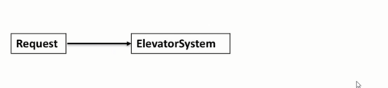
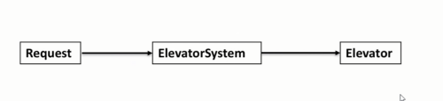
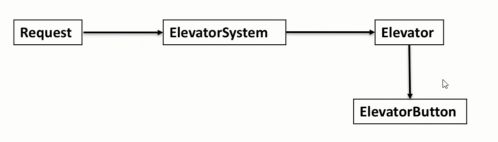
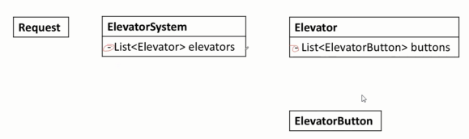
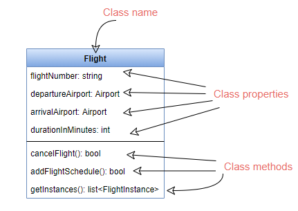
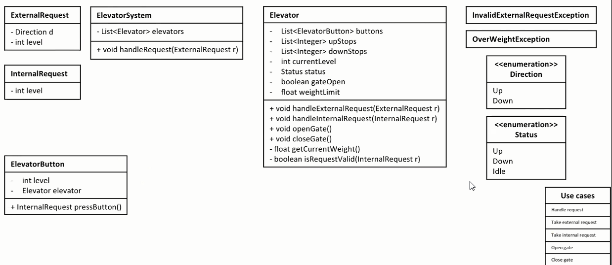
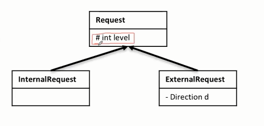

### 面向对象设计（OOD）
#### Clarify
1. What

    *针对题目中的关键字来提问，帮助自己更好的确定答题范围* 。大多数的关键字为名词，通过**名词的属性**来考虑。（不要考虑太过通用的属性）

    **Example**
    ```
    设计电梯系统

    Elevator属性: 
        - 电梯的载重 (涉及之后的 Use case)

        - 是否需要设计两种类，如果需要它们之间是什么关系

        - 客梯和货梯有什么区别

    Building属性：
        - 是否有多处能搭乘的电梯口
          -- 当收到一个搭乘电梯的请求时，有多少电梯能够响应。
    ```

2. How

    *针对问题主题的规则来提问，帮助自己明确解题方向*。没有标准答案，可以提出一些解决方法，通过面试官的反应，选择一个比较有信心（简单）的方案

    **Example**
    ```
    - 当按下按钮时，哪一台电梯会响应
      -- 同方向 > 静止 > 反向
      -- 一般负责奇数楼层，一般负责偶数楼层

    - 当电梯在运行时，哪些按键可以响应
      -- 是否能按下反向的楼层
    ```

3. Who

    *设计由人主导 VS 设计由系统主导？*
    由人主导比较繁琐，一般设计由系统主导，一系列输入经过系统产生一系列输出。

    ```
    Input-->|Black Box|-->Output
    ```

#### Core Object
1. 为什么要定义Core Object
    - 这是和面试官初步的纸面contract
    - 承上启下，来自于Clarify的结果，成为Use case的依据
    - 为画类图打下基础

2. 如何定义Core Object
    - **以一个Object为基础，线性思考**
        ```
        在白板上首先以系统的名字为第一个类，然后考虑输入输出
        ```
        
        
        
        

    - **确定Objects之间的映射关系**
        
        ```
        Good Practice:

        public 用'+'来标识
        private 用'-'来标识
        protected 用'#'来标识
        ```

#### Cases
1. 为什么要写Use cases
    - 这是和面试官白纸黑字达成的第二份共识，把将要实现的功能列在白板上
    - 帮助在解题的过程中，理清条理，一个一个Case的实现
    - 作为检查的标准

2. 怎么写Use cases
    - 利用定义的Core Object, **列举出每个Object对应产生的Use case**
    - 每个Use case只需要先用一句简单的话来描述即可
        ```
        ElevatorSystem
         - Handle request

        Request
        - None

        Elevator
        - take external request
        - take internal request
        - open gate
        - close gate
        - check weight

        ElevatorButton
        - press button

        无需考虑所有的Use case， 这部分可以和面试官沟通
        ```

#### Class
1. 为什么画类图
    - 可交付，Minimal Viable Product
    - 节省时间， 不容易在Coding上挣扎
    - 建立在Use case 之上，和之前的步骤层层递进，条理清晰，便于交流和修改
    - 如果时间允许/面试官要求，便于转化成Code
    
    

2. 怎么画类图
    - 遍历所列出的Use cases
    - 对于每一个use case, 更加详细的描述这个use case在做什么事情
        ```
        Example:

        handle request-->ElevatorSystem takes an external request, and decide to push this request to an appropriate elevator 

        Input: external request
        Output: elevator
        ```
    - 针对这个描述，在已有的Core objects里填充进所需要的信息
        ```
        Good Practice:

        用Exception来指代错误
        ```
    
    

#### Correctness
1. 从以下几方面检查
    - Validate use cases(检查是否支持所有的use case)
    - Follow good practice(加分项)
    - S.O.L.I.D
    - Design pattern

    