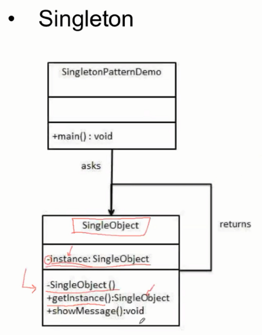
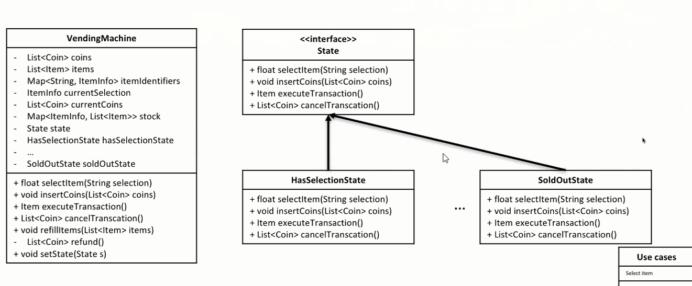

### Strategy design pattern

针对一个Use case, 根据情况不同，采取不同的策略

if-else模式不利于扩展


定义一个表示Strategy的抽象类，然后分别由具体的Strategy去实现各自的接口功能


### Singleton Design pattern



```C++
// singleton template

class S
{
    public:
        static S& getInstance()
        {
            static S    instance; // Guaranteed to be destroyed.
                                // Instantiated on first use.
            return instance;
        }
    private:
        S() {}                    // Constructor? (the {} brackets) are needed here.

        // C++ 03
        // ========
        // Don't forget to declare these two. You want to make sure they
        // are inaccessible(especially from outside), otherwise, you may accidentally get copies of
        // your singleton appearing.
        S(S const&);              // Don't Implement
        void operator=(S const&); // Don't implement

        // C++ 11
        // =======
        // We can use the better technique of deleting the methods
        // we don't want.
    public:
        S(S const&)               = delete;
        void operator=(S const&)  = delete;

        // Note: Scott Meyers mentions in his Effective Modern
        //       C++ book, that deleted functions should generally
        //       be public as it results in better error messages
        //       due to the compilers behavior to check accessibility
        //       before deleted status
};
```

### State Design Pattern

针对多个Use case 进行状态间的状态转换，在特定状态下有特定的具体行为

