### 实物类OOD

- Vending machine
- Jukebox
- CD Player
- Coffee maker
- Kindle

#### 解题技巧
1. 考虑对于实物的输入输出
    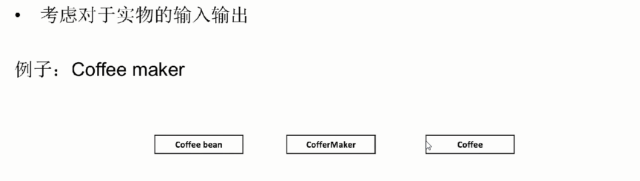

2. 运用Design Pattern
    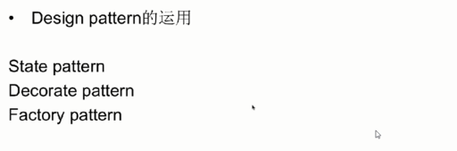

#### Example1: Vending machine

1. Clarify

    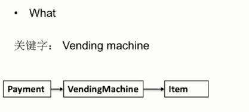
    

    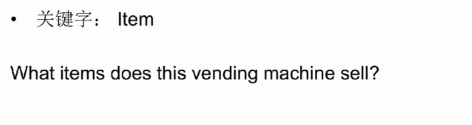
    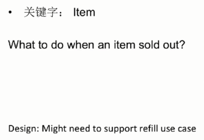

    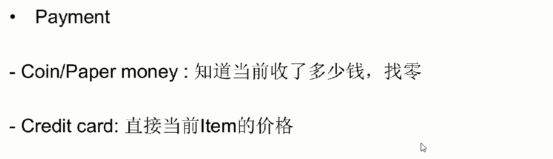

2. Core object

    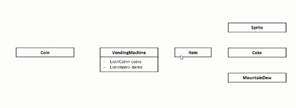

3. Use case

    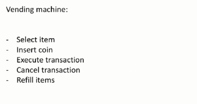

4. Class

    初始状态
    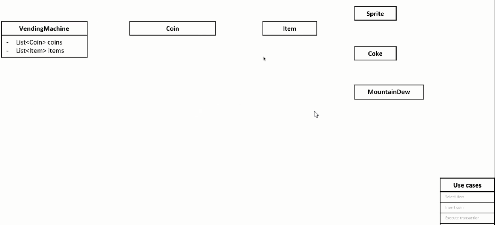

    分析第一个Use case
    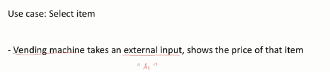
    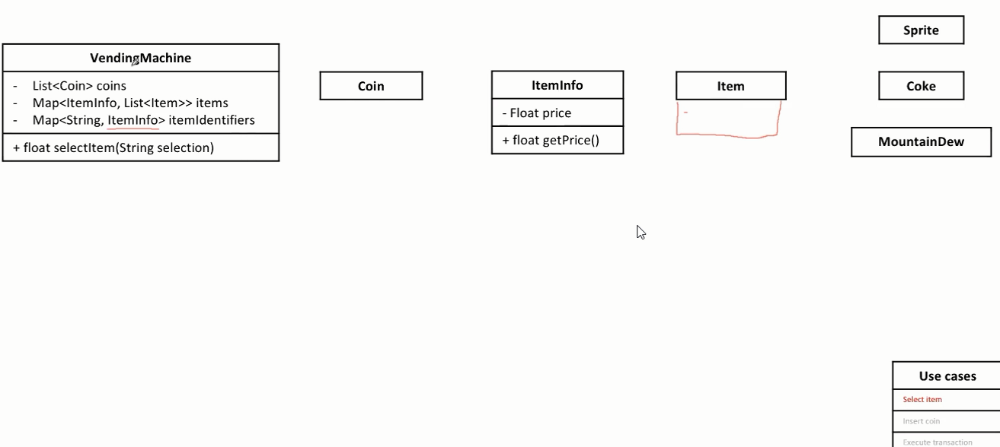

    分析第二个Use case
    
    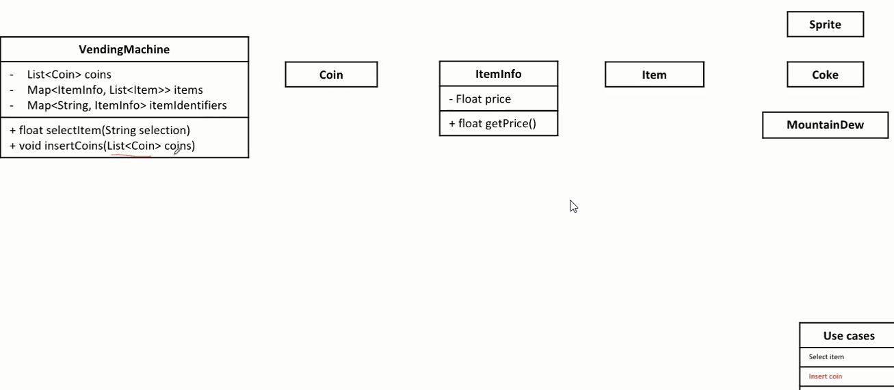

    分析第三个Use case
    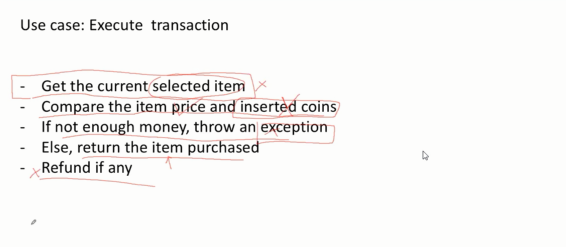
    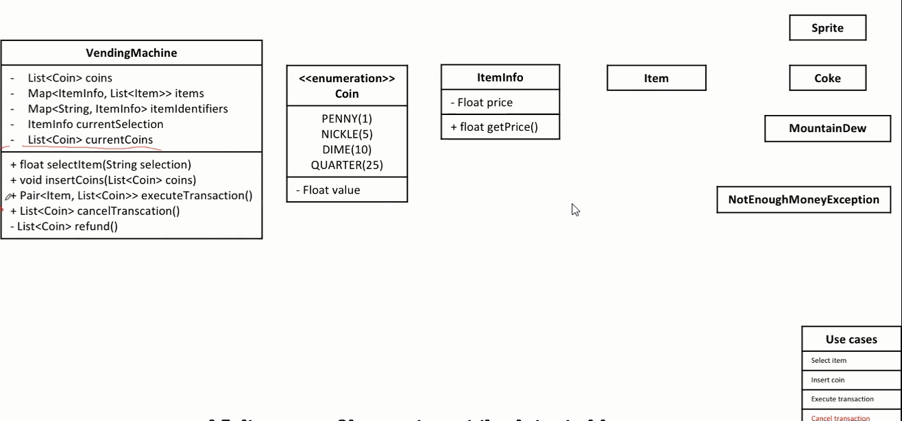

    分析第四个Use case
    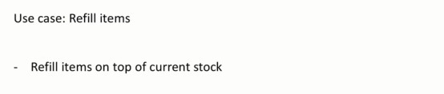
    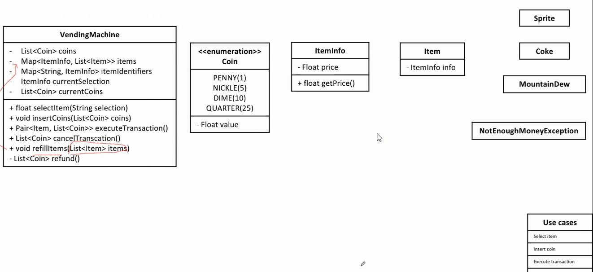

    **Good practice**
    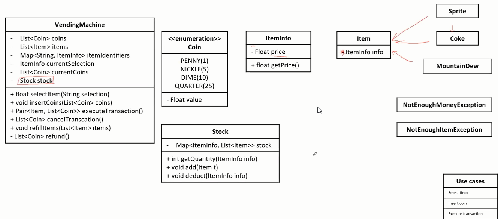