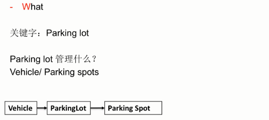
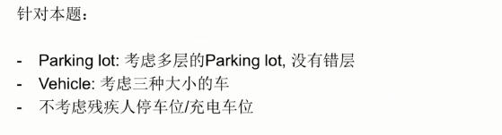
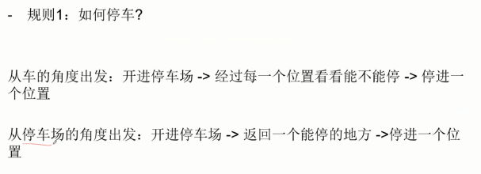
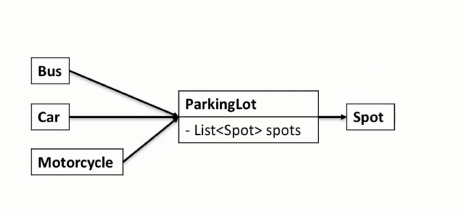
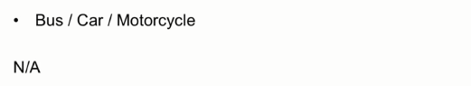
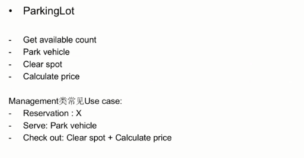
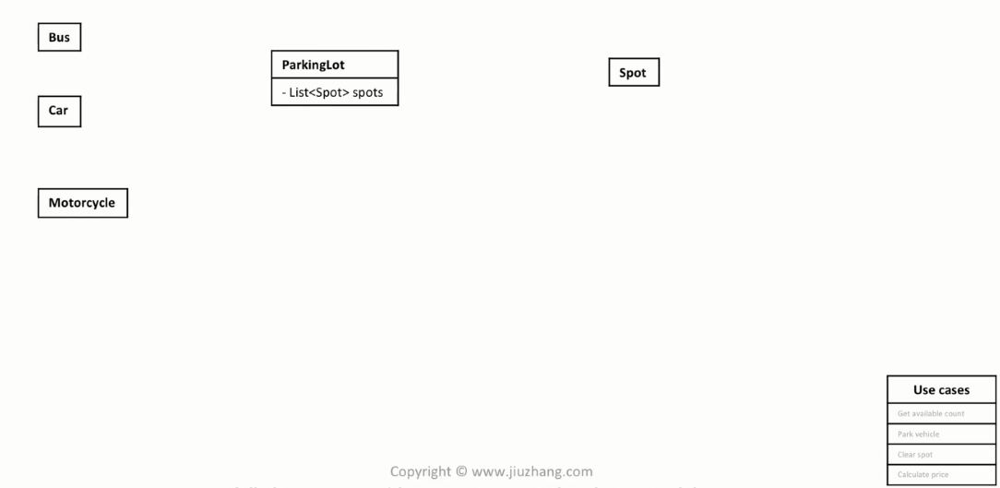
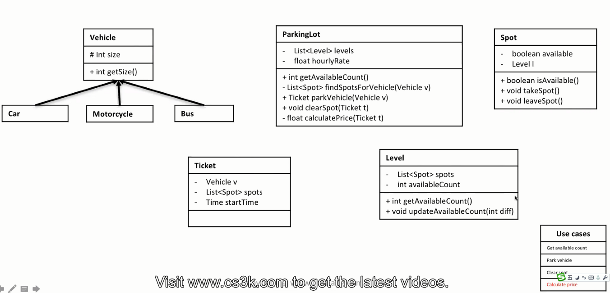

### 管理类OOD

**特征： 题目后面都可以接三个字 “管理员”**。设计一个模拟/代替管理员日常工作的系统

- Gym
- Parking lot
- Restaurant
- Library
- Super market
- Hotel

1. Clarity-What

    除了题目中问的名词外，还需要从管理的名词来考虑

    ```
    Example:

    关键词1： Parking lot
    关键词2： Vehicle
    关键词3： Spot
    ```

2. Core Object->有进有出

    考虑这个管理系统中，**Input** 和 **Output** 是什么
    ```
    Example: 

    Input: Request
    Output: Elevator
    ```
3. Use case->从**管理员角度**考虑
    
    **管理类常见的Use case**

    - Reserve
    - Serve
    - Checkout

4. Class

    在设计类图的时候，经常可以使用**收据**的形式，来保管信息
    ```
    Example: 

    User---|Receipt|---Book
    ```

#### Example: Parking lot
1. Clarity
    关于What 方面和面试官进行沟通

    

    和面试官沟通之后

    

    分析how的时候，强调从**系统的角度**出发去考虑

    

    ```
    规则Example:

    是否计费
    停车场是否需要统计已停数量
    ```

2. Core Object

    不推荐将 Car类保存在 ParkingLot类中或 Spot类中，一方面 Car类是动态的，而 ParkingLot 和 Spot 是静态的；另一方面也引入了限制（假如Car类中的接口改变了，那么ParkingLot 或 Spot类中的某些方法也很有可能需要改变）。

    

3. Cases

    **站在管理员的角度想**

    

    
    
    

4. Class

    初始情况

    

    **注意使用收据来解决类之间的映射关系**

    

