### 预定类OOD

- Restaurant reservation system
- Hotel reservation system
- Flight/Bus/Train reservation system

#### 解题思路
1. What

    考虑预定的东西
    ```
    Example : 机票

    机舱/座位号/时间
    ```
2. Use case

    - Search
    - Select
    - Cancel

    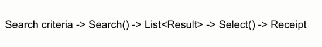

3. Class

    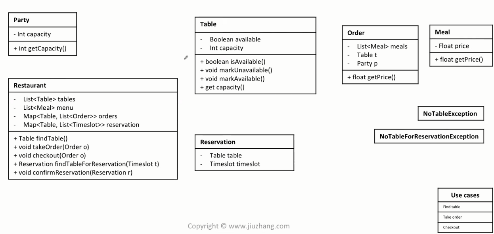

#### Example: Hotel reservation system

1. Clarity

    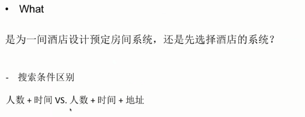

    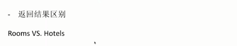

    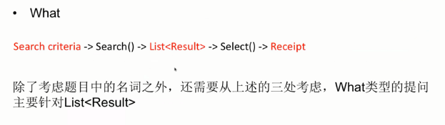

    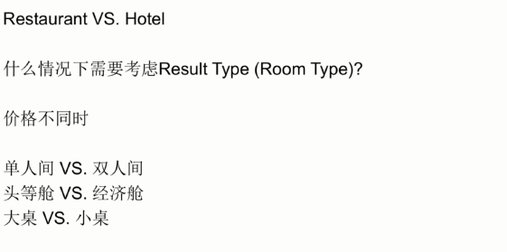

2. Core object

    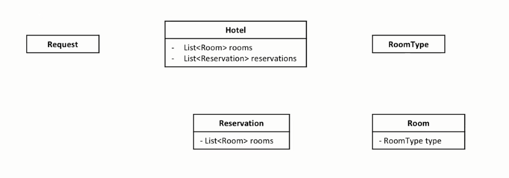

3. Use case

    **Search, Select, Cancel**

    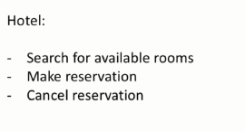

4. Class
    
    根据Use case中的内容来扩充类图

    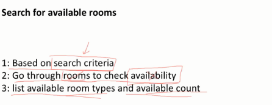

    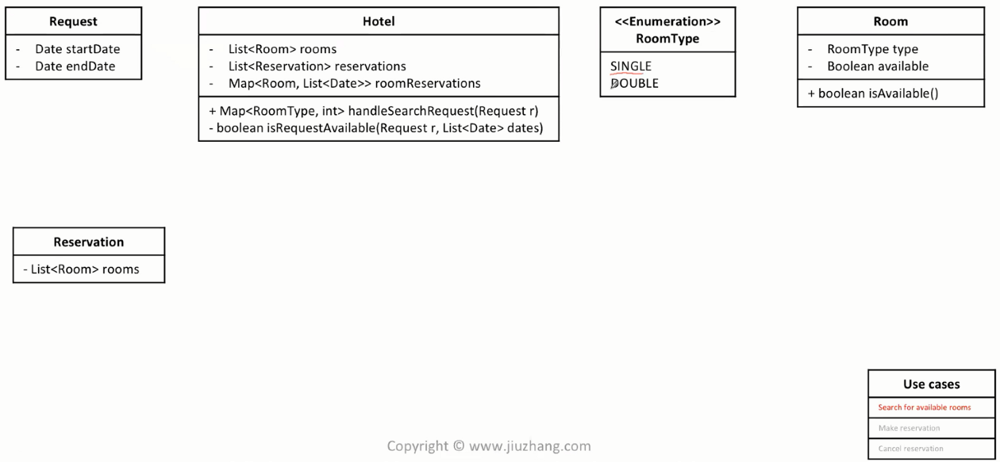

    加分项：使用 **LRU Cache** 来加速查询过程

    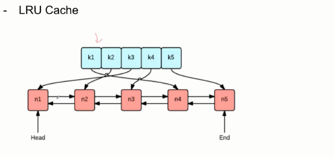

    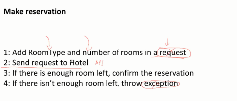

    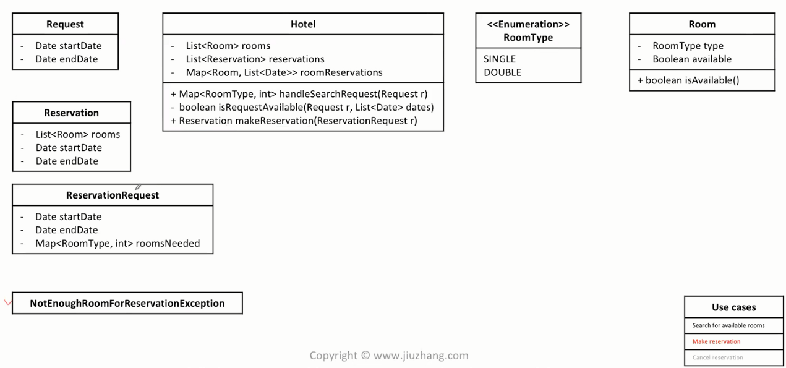

    Cancel reservation

    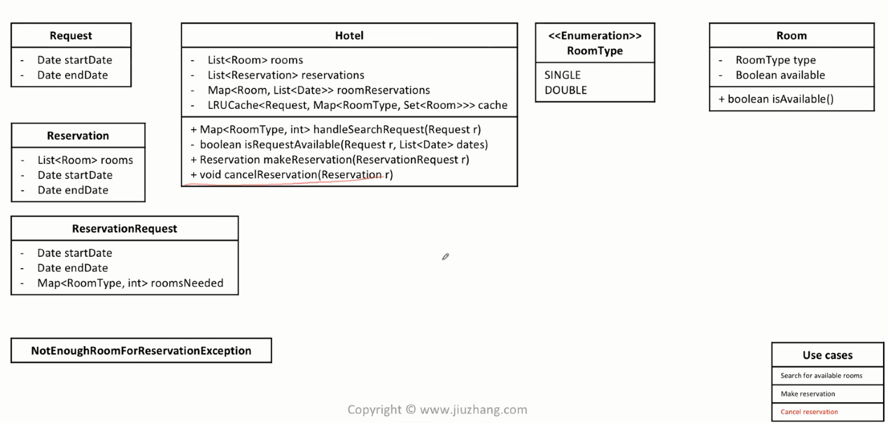


