# 操作系统概述

## 1. 基本特征

### 1.1 并发

**并发**是指宏观上在一段时间内能同时运行多个程序，**并行**则指同一时刻能运行多个指令。

并行操作需要硬件支持，如多流水线、多核处理器或者分布式系统。

操纵系统通过引入进程和线程，使得程序能够并发运行。

### 1.2 共享

共享是指系统中的资源可以被多个并发进程共同使用。

两种共享方式：

- 互斥共享
- 同时共享

### 1.3 虚拟

虚拟技术把物理实体转换为逻辑实体。

- **时分复用**

  多个进程能在同一个处理器上并发执行使用了时分复用技术，让每个进程轮流占用处理器，每次只执行一小个时间片并快速切换。

- **空分复用**

  虚拟内存使用了空分复用技术。将物理内存抽象为地址空间，每个进程都有各自的地址空间。地址空间的页被映射到物理内存，地址空间的页并不需要全部在物理内存中，当使用一个没有在物理内存的页时，执行页面置换算法，将该页置换到内存中。

### 1.4 异步

异步指进程不是一次性执行完毕，而是以不可预知的速度向前推进。内存中的每个进程何时执行，何时暂停，以怎样的速度向前推进都是不可预知的。

## 2. 基本功能

- **进程管理**：进程控制、进程同步、进程通信、死锁处理等
- **内存管理**：内存分配、地址映射、虚拟内存等
- **文件管理**：文件存储空间的管理、目录管理、文件读写管理和保护等
- **设备管理**：完成用户的 I/O 请求，设备分配、设备处理、虚拟设备等

## 3. 系统调用

如果一个进程在**用户态**需要使用**内核态**的功能，就进行系统调用进而进入内核，由操作系统代为完成。

- **内核空间**：操作系统内核的运行空间
- **用户空间**：用户程序的运行空间。

为了安全，两者之间是隔离的，即使用户的程序崩溃了，内核也不受影响。


Linux的系统调用主要有以下这些：

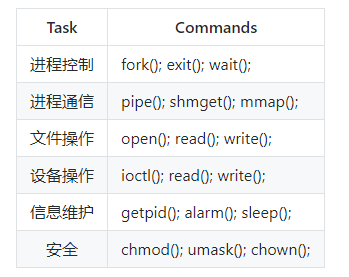

### 什么是用户态和内核态

为了限制不同程序的访问能力，防止一些程序访问其它程序的内存数据， CPU 划分了用户态和内核态两个权限等级。

- 用户态只能受限的访问内存，且不允许访问外围设备。
- 内核态可以访问内存所有数据以及外围设备，也可以进行程序的切换。

所有用户程序都运行在用户态，但有时需要进行一些内核态的操作，比如从硬盘或键盘读取数据，这是就需要进行系统调用，CPU 切换到内核态，执行响应的服务，再却换为用户态并返回系统调用的结果。

### 如何从用户态切换到内核态

- 系统调用
- 用户程序发生异常时：例如缺页异常
- 外围设备的中断：外围设备完成用户请求的操作之后，会向 CPU 发出中断信号，这时 CPU 会转去处理对应的中断处理程序。

# 进程管理

## 1. 进程与线程

### 进程

进程是**资源分配**的基本单位。

进程控制块（Process Control Block, PCB）描述进程的基本信息和运行状态。所谓的创建进程和撤销进程，都是指对 PCB 的操作。

### 线程

线程是**独立调度**的基本单位。

一个进程中可以有多个线程，它们共享进程资源。

### 进程和线程的区别

- **资源**：进程是资源分配的基本单位，线程自身不拥有资源。进程有自己的独立地址空间，线程共享所属进程的地址空间。

- **调度**：线程是独立调度的基本单位。在同一进程中，线程的切换不会引起进程的切换；从一个进程中的线程切换到另一个进程中的线程时，会引起线程切换。
- **系统开销**：在创建或销毁进程时，系统都要为之分配或回收资源，如内存空间、I/O 设备等，系统开销远大于创建或销毁线程时的开销。类似的，在进行进程切换时，涉及当前进程CPU 环境的保存和新调度进程 CPU 环境的设置，而线程切换时只需保存和设置少量寄存器内存。
- **通信**：线程之间可以直接读写同一进程中的数据进行通信，但是进程之间通信需要借助 IPC （进程间通信）的方式进行。

## 2. 进程状态的切换

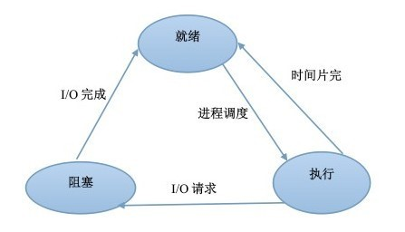

- **就绪状态**：进程已获得的除 CPU 之外的所需资源，等待系统的调度。
- **运行状态**：占用 CPU 资源运行
- **阻塞状态**：进程等待资源，在条件满足之前无法执行。该资源不包括 CPU 资源，缺少 CPU 资源会从运行状态转为就绪状态。

只有就绪状态和运行状态可以相互转换，其它的都是单向转换。

## 3. 进程调度策略

### 3.1 批处理系统

对于批处理系统来说一般不涉及太多的用户操作，调度算法的目标是保证吞吐量和周转时间。

#### 先来先服务

> FCFS

非抢占式的调度算法，按照请求的顺序进行调度。

对于短进程，必须一直等待前面的长进程执行完成后才能执行，可能会造成等待时间过长。

#### 最短作业优先

> SJF

非抢占式的调度算法，按估计运行时间最短的顺序进行调度。

可能会导致饥饿问题，长进程可能会饿死，处于一直等待前面的短进程执行完毕的状态。

#### 最短剩余时间优先

> SRTN

最短作业优先的抢占式版本，按剩余运行时间的顺序进行调度。当一个新的进程到达时，其整个运行时间与当前进程的剩余时间进行比较。如果新的进程需要的时间更少，则挂起当前进程，运行新的进程，否则新的进程等待。

仍可能导致饥饿问题，对长进程不利。

#### 最高响应比优先

> HRRN

``响应比 = 1 + 等待时间 / 处理时间``。同时考虑了等待时间的长短和估计需要执行的时间的长短，很好的平衡了长短进程。非抢占，无饥饿问题。

### 3.2 交互式系统

交互式系统一般会有大量的用户交互操作，在该系统中调度算法的目标时快速地进行响应。

#### 时间片轮转

所有就绪进程按 FCFS 的原则排成一个队列，每次调度时，把 CPU 时间分配给队首进程，该进程可以执行一个时间片，随后排到队列的尾部。

该算法的效率和时间片的大小有很大关系：

- 如果时间片太小，会导致进程切换的太频繁，造成较大的系统开销。
- 如果时间片太大，那么实时性就得不到保证。

#### 优先级调度

为每个进程分配一个优先级，按优先级进行调度。

为了防止低优先级的进程永远等不到调度，可以随着时间的推移增加等待进程的优先级。

#### 多级反馈队列

如果一个进程需要执行 100 个时间片，那么采用时间片轮转调度需要 100 次轮转。

设置多个队列，他们执行的时间片递增（例如1, 2, 4, 8, ...），优先级递减。如果进程在第一个队列中没执行完就会被移到下一个队列。

因为这些队列的优先级递减。所以只有上一个队列中没有进程在等待时，才能调度当前队列上的进程。

### 3.3 实时系统

实时系统要求一个请求在一个确定的时间内得到响应

分为软实时和硬实时，前者可以容忍一定的超时，后者要求必须满足绝对的截止时间。

## 4. 进程同步

### 4.1 概念

进程同步是指控制多个进程按一定顺序执行。

**进程的同步是目的，而进程间通信是实现进程同步的手段**。

#### 临界区

- **临界资源**：互斥资源/共享变量，一次只能给一个进程使用。

- **临界区**：各个进程中对临界资源进行操作的程序片段。

为了互斥访问临界资源，每个进程在进入临界区之前，需要先进行检查。

#### 同步与互斥

- **同步**：多个进程因为合作而使得进程的执行有一定的先后顺序。例如某个进程需要另一个进程提供的消息，在获得消息之前进入阻塞状态。
- **互斥**：多个进程在同一时刻只有一个能进入临界区。

并发、并行、异步的区别

- 并发：宏观上在一个时间段中同时有多个程序在运行，但其实在任一时刻，只有一个程序在 CPU 上运行，宏观上的并发时通过不断的切换实现的。
- 多线程：并发运行的一段代码。
- 并行：在多 CPU 系统中，多个程序无论是宏观还是微观上都是同时运行的。
- 异步：同步是顺序执行，异步是在等待某个资源的时候继续做自己的事情，不阻塞。

#### 信号量

一个信号量 s 是一个全局整型变量（非负）。可以对其执行 P 操作 和 V 操作。

- **P(s)**：如果 s 的值大于0，P 操作使 s 的值减一，并且立即返回；否则，进程/线程阻塞，直到  s 的值大于0 且被 V 操作唤醒。
- **V(s)**：V 操作使得 s 的值加一。如果当前有多个进程/线程阻塞在 P 操作，V 操作只唤醒它们其中的一个。

如果信号量的取值只能是 0 或者 1 ，那么就成为了 **互斥量**。又 P 操作和 V 操作分别进行加锁和解锁。

#### 管程

管程将共享变量以及对这些共享变量的操作封装起来，形成一个具有一定接口的功能模块。

进程只能互斥的使用管程，使用完之后必须释放管程并唤醒入口等待队列中的进程。

### 4.2 进程同步问题

#### 生产者-消费者问题

问题描述：使用一个缓冲区来保存物品，只有缓冲区没有满，生产者才可以放入物品，只有缓冲区不为空，消费者才可以拿走物品。

系统提供的标准信号量函数

```C++
#include <semaphore.h>

int sem_init(sem_t* sem, 0, unsigned int value);
int sem_wait(sem_t* s);
int sem_post(sem_t* s);
```

用 P 和 V 封装 sem_wait 和 sem_post

```C++
void P(sem_t* s);
void V(sem_t* s);
```

定义插入、删除操作

```C++
// 定义信号量
sem_t items; // 记录缓冲区物品数量
sem_t slots; // 记录缓冲区空位数量
sem_t mutex; // 互斥量

int n; // 缓冲区大小
int* buf; // 缓冲区
int front; // front + 1 指向第一件物品
int rear; // 指向末尾物品

void init(int sz){
    buf = (int*)malloc(n, sizeof(int));
    n = sz;
    front = rear = 0;
    sem_init(items, 0, 0);
    sem_init(slots, 0, n);
    sem_init(mutex, 0, 1);
}

void insert(int item){
    P(&slots);
    P(&mutex);
    buf[(++rear) % n] = item;
    V(&mutex);
    V(&items);
}

int remove(){
   int item;
    P(&items);
    P(&mutex);
    item = buf[(++front) % n];
    V(&mutex);
    V(&slots);
    return item;
}
```

生产者和消费者分别调用 insert 和 remove 来实现同步。

#### 读者-写者问题

允许多个进程/线程同时对数据进行读操作，但是不允许读和写以及写和写操作同时发生。

倾向于读者，除非写者已经获得了互斥锁，否则多个读者都无需等待。有可能导致写者饥饿。

```C++
int readcnt = 0;
sem_t mutex = 1; // 保护 readcnt 的信号量
sem_t w = 1; // 保护临界区的信号量

void reader(void){
    while(1){
        P(&mutex);
        readcnt++;
        if(readcnt == 1) // 第一个读者
            P(&w);
        V(&mutex);
        
        //critical section
        // reading happens;
        
        P(&mutex);
        readcnt--;
        if(readcnt == 0) // 没有读者了
            V(&w);
        V(&mutex);
    }
}

void writer(void){
    while(1){
        P(&w);
        
        // critical section
        // writring happens
        
        V(&w);
    }
}
```

倾向于写者

```C++
int writecnt = 0;
sem_t mutex;
sem_t w;

void reader(){
    while(1){
        if(writecnt > 0) continue;
        
        P(&w);
        
        // critical section
        // reading happens;
        
        V(&w);
    }
}

void writer(){
    while(1){
        P(&mutex);
        writecnt++;
        V(&mutex);
        
        P(&w);
        
        // critical section
        // writing happens
        
        V(&w);
        
        P(&mutex);
        writecnt--;
        V(&mutex);
    }
}
```

#### 哲学家就餐问题


## 5. 进程通信

- 进程同步：控制多个进程按一定顺序执行。
- 进程通信：进程间传输信息。

进程同步是目的，进程通信是实现进程同步的手段。为了能够达到进程同步的目的，需要让进程间进行通信，传输一些进程同步所需要的信息。

主要的进程间通信方式有：

- 管道
- 命名管道
- 消息队列
- 信号量
- 共享内存
- 套接字

### 管道

管道是通过调用 pipe 函数创建的。

```c++
#include <unistd.h>
int pipe(int fd[2]);
```

其中 fd[0] 用于读，fd[1] 用于写。

它具有以下限制：

- 只支持半双工通信。
- 只能在父子进程或者兄弟进程中使用。


### 命名管道（FIFO）

去除了管道只能在父子进程中使用的限制。

```C++
#include <sys/stat.h>
int mkfifo(const char *path, mode_t mode);
int mkfifoat(int fd, const char *path, mode_t mode);
```

FIFO 常用于客户-服务器应用程序中，在客户进程和服务器进程之间传递数据。


### 消息队列

相比于 FIFO，消息队列的优点：

- 避免了 FIFO 的同步阻塞问题，不需要进程自己提供同步方法。
- 消息队列可以独立于读写进程存在，从而避免了 FIFO 中同步管道的打开和关闭时产生的困难。
- 读进程可以根据消息类型有选择的接收消息，而不像 FIFO 那样只能默认的接收。

### 信号量

用于为多个进程/线程提供对共享数据对象的访问。

### 共享内存

允许多个进程共享一个给定的存储区。因为数据不需要在进程之间复制，所以这是最快的一种 IPC。

需要使用信号量来同步对共享内存的访问。

多个进程可以将同一个文件映射到它们的地址空间从而实现共享内存。

### 套接字

与其它通信机制不同的是，它可用于不同机器间的进程通信。

## 6. 僵尸进程和孤儿进程

### 僵尸进程

一个子进程结束后，它的父进程并没有等待它（调用wait 或者 waitpid），那么这个子进程将成为一个僵尸进程。

僵尸进程是一个已经死亡的进程，但是没有真正被销毁。它已经放弃了几乎所有的内存空间，没有任何可执行的代码，也不能被调度，仅仅再进程表中保留一个位置，记载该进程的进程 ID 、终止状态等。

僵尸进程可能会一直留在系统中直到系统重启。

危害：

- 占用进程号，系统所能使用的进程号是有限的
- 占用内存

以下情况不会产生僵尸进程：

- **该进程的父进程先结束了**：每个进程结束时，系统都会扫描是否存在子进程，如果有则 Init进程（进程 ID 为1）接管，成为该进程的父进程，并且会调用 wait 等待其结束。
- **父进程调用wait 或 waitpid 等待子进程结束**：wait 会令父进程阻塞直到某个子进程结束；waitpid 可以设置为非阻塞，且等待指定 pid 的子进程。
- **注册信号处理函数**：子进程结束时，系统会产生 SIGCHLD 信号，可以注册一个信号处理函数，在该函数中调用 waitpid，等待所有结束的子进程。

### 孤儿进程

一个父进程已经结束了，但是它的子进程还在运行。那么这些子进程将成为孤儿进程。孤儿进程会被 Init （进程 ID 为1）接管，当这些孤儿进程结束时由 Init 完成状态收集工作。

## 7. 线程

### 线程同步

- 互斥量
- 信号量
- 事件 Event：允许一个线程在处理完一个任务后，主动唤醒另一个线程执行任务。
- 临界区

### 协程

协程是一种用户态的轻量级线程，协程的调度完全由用户控制。协程拥有自己的寄存器上下文和栈。协程调度切换时，将寄存器上下文和栈保存到其它地方，在切换回来的时候，恢复先前保存的寄存器上下文和栈。

# 死锁

## 必要条件

死锁产生的必要条件：

- **互斥**：每个资源要么已经分配给了一个进程，要么就是可用的
- **占有并等待**：一个进程至少占有一个资源，并且在等待另一个被其它进程占用的资源。
- **不可抢占**：已经分配给一个进程的资源不能强制性的被抢占，它只能被占有它的进程显式的释放。
- **环路等待**：有两个或两个以上的进程组成一条环路，该环路上的每个进程都在等待下一个进程所占有的资源。

## 处理方法

- 鸵鸟策略
- 死锁检测与死锁恢复
- 死锁预防
- 死锁避免

### 鸵鸟策略

把头埋在沙子里，假装根本没发生问题。

因为解决死锁的代价很高，因此鸵鸟策略这种不采取任何措施的方案会获得更高的性能。

当发生死锁不会对用户造成太大影响，或发生死锁的概率比较低的时候可以采用鸵鸟策略。

### 死锁检测与死锁恢复

不试图阻止死锁，而是当检测到死锁发生时，采取措施进行恢复。

#### 每种类型一个资源

指每种类型的资源只有一个。

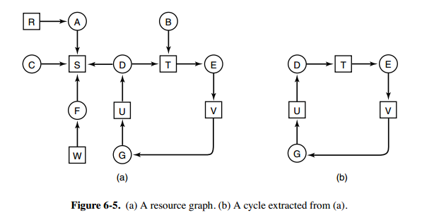

构造如上图所示的资源分配图

- 方框表示资源
- 圆圈表示进程
- 资源指向进程表示该资源已经分配给该进程
- 进程指向资源表示进程请求获取该资源。

通过检测有向图是否存在环来实现。

#### 每种类型多个资源

指每种类型的资源有多个。


如上图，有三个进程和四个类型的资源

- E 向量：每种类型的资源总量
- A 向量：每种类型的资源剩余量
- C 矩阵：每一行都代表一个进程所拥有的资源数量
- R 矩阵：每一行代表一个进程请求的资源数量

死锁检测：

每个进程最开始都不被标记，执行过程中有可能被标记。当算法结束时，任何没有被标记的进程都是死锁进程。

1. 寻找一个没有标记的进程 P ，它所请求的资源 A 中可以满足
2. 如果找到了这样一个进程，那么将 C 矩阵对应行的向量加到 A 中，标记该进程，并转回 1
3. 如果没有这样一个进程，算法终止。

#### 死锁恢复

- **利用抢占**：挂起某些进程，并抢占它的资源。但应防止某些进程被长时间挂起而处于饥饿状态
- **利用回滚**：让某些进程回退到足以解除死锁的地方，进程回退时资源释放。要求系统保持进程的历史信息，设置还原点。
- **杀死进程**：强制杀死某些进程直到死锁解除为止，可以按照优先级进行。

### 死锁预防

在**程序运行之前**指定规则预防发生死锁。

基本思想时破坏形成死锁的四个必要条件。

- **破坏互斥条件**：允许某些资源同时被多个进程访问。但有些资源本身不具有这种属性，因此这种方案实用性有限。

- **破坏占有并等待条件**：

  - 一种是进程在开始执行前请求所需要的全部资源。（不等待）

  - 另一种是只允许进程在没有占用资源的时候才能申请资源。（不占有）

  很多时候无法预知一个进程所需要的全部资源，同时这样会降低资源利用率，降低系统的并发性。

- **破坏非抢占条件**：允许进程抢占被其它进程占有的资源。

- **破坏环路等待**：给资源同一编号，所有进程对资源的请求必须按照编号递增的顺序提出。可以避免占有大号资源的进程去申请小号资源。

### 死锁避免

在**程序运行时**避免发生死锁。

动态的检测资源分配状态，以确保系统处安全状态，只有处于安全状态时才会进行资源的分配。


- Has：进程已拥有的资源数
- Max：进程总共需要的资源数
- Free：系统中还可以访问的资源数

**安全状态**：如果没有死锁发生，并且即使所有进程突然请求对资源的最大需求，也仍然存在某中调度次序使得每一个进程运行完毕。

安全状态的检测和死锁的检测很类似，因为判断一个状态是否安全就是在检测它是不是死锁状态。

#### 单个资源的银行家算法

一个银行家向一群客户分别承诺了一定的贷款额度，算法要做的是判断对请求的满足是否会进入不安全状态，如果是就拒绝请求，否则予以分配。


上图 c 为不安全状态，因此算法会拒绝进入 c 状态的请求。

#### 多个资源的银行家算法


上图中有五个进程和四个类型的资源。

- 左图：已经分配的资源
- 右图：还需要分配的资源
- E：总资源，不是具体数值而是向量，例如E = (6342)表示四个资源的总量分别为(6, 3, 4, 2)。
- A：已分配资源，也是向量
- P：可用资源，也是向量

检查一个状态是否是安全的算法：

- 查找右边的矩阵是否存在一行小于等于 A ,如果不存在则系统会发生死锁，该状态不安全
- 如果找到了，将该进程标记为终止，并将其资源加到 A 中。
- 重复以上两步，直到所有进程都标记为终止，则状态时安全的。

# 内存管理

## 虚拟内存

虚拟内存为每个进程提供了一个统一的独立地址空间。这个地址空间被分割成多个块，每一块称为一页。这些页被映射到物理内存，但不需要所有的页都在物理内存中，当程序引用不在物理内存中的页时，由硬件执行必要的映射，将缺失的部分装入物理内存并重新执行失败的指令。

虚拟内存允许程序不用将地址空间的每一页都映射到物理内存，也就是说一个程序不需要全部调入内存就可以运行，这使得有限的内存运行大程序成为可能。

## 地址映射

内存管理单元（MMU）管理着虚拟地址和物理地址的转换。

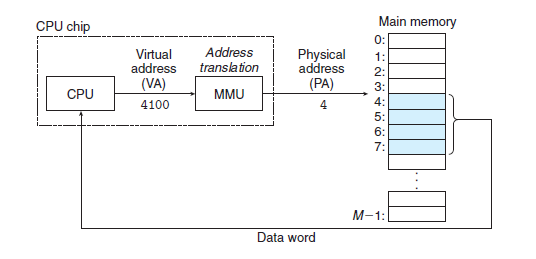

MMU 通过 页表（Page Table）来实现映射。 每个进程都有自己的页表，因为每个进程都有自己的虚拟地址空间。CPU 中的 PTBR 寄存器用来指向当前进程的 Page Table。

一个虚拟地址分成两部分，一部分存储页面号（Virtual page number, VPN），一部分存储偏移量（Virtual page offset, VPO）。

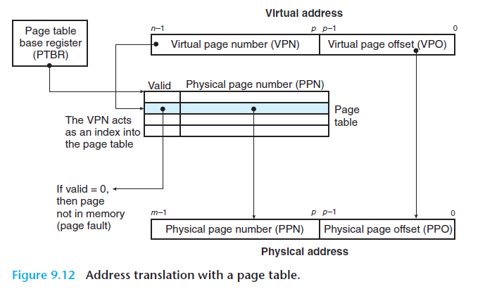

## 页面置换算法

在程序运行过程中，如果要访问的页面不在物理内存中，就会发生缺页中断（Page fault），之后系统将该页调入物理内存中。如果此时物理内存已满，则系统需要从内存中调出一个页面到磁盘来让出空间。

由于物理内存相当于磁盘的缓存，所以页面置换算法和缓存淘汰策略类似。

页面置换算法的主要目标是使页面置换频率最低。

### 最佳页面置换算法

> Optimal replacement algorithm, OPT

所选择的被置换出的页面将是最长时间内不再被访问的。

是一种理论上的算法，因为无法知道一个页面多长时间不再被访问。

### 最近最少使用算法

> Least Recently Used, LRU

置换出未使用时间最长的一页。

在内存中维护一个包含所有页面的链表。当一个页面被访问时，将这个页面移到链表表头，这样就能保证链表表尾的页面时最近最少访问的。

### 最近未使用算法

> Not Recently Used, NRU

每个页面都有两个状态位：R 和 M，当页面被访问时设置页面的 R = 1，当页面被修改时设置 M = 1。其中 R 位会被定时清零。可以将页面分成以下四类：

- R = 0, M = 0
- R = 0, M = 1
- R = 1, M = 0
- R = 1, M = 1

当发生缺页中断时，NRU算法优先换出（R = 0, M = 0）的页面，其次是（R = 0, M = 1）的页面。而不是被频繁读取的页面。

### 先进先出

> First In First Out, FIFO

选择换出的页面是最先进入的页面，也就是在内存中驻留最长的页面。

有可能将那些经常被访问的页面也换出。

### 第二次机会算法

> SCR

对 FIFO 算法进行改进。

当页面被访问时设置该页面的 R 位为1。需要替换时，检查最老页面的 R 位，如果 R 位为0，那么这个页面既老又没有被使用，可以立即置换掉。如果是 1 ，就将 R 位清零，并且把它放到链表末端，就像刚装入那样。然后继续从链表的头部开始搜索。

### 时钟算法

SCR 需要将页面在链表中移动，时钟算法使用环形链表，再使用一个指针指向最老的页面，避免了移动页面的开销。


## 分段

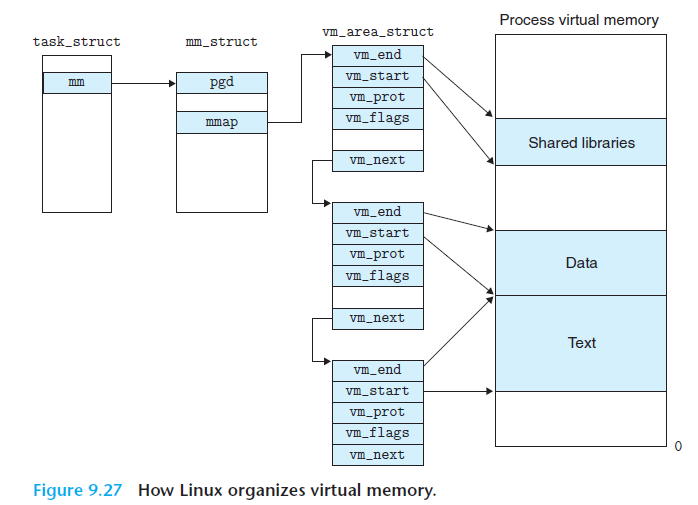

用户进程地址空间按照自身逻辑关系划分为若干个段：代码段、数据段、bss段、堆栈段等。

每一个存在的虚拟页都属于某一段。段的表式允许虚拟地址空间存在间隙，即内核不需要追踪管理那些不存在的虚拟页。

# I/O

## I/O 模型

- blocking IO --阻塞IO
- nonblocking IO --非阻塞IO
- IO multiplexing --IO多路复用
- signal driven IO --信号驱动IO
- asynchronous IO --异步IO

其中前四个都属于同步IO

### blocking IO


用户进程在recvfrom操作的两个阶段都是等待的。在数据还没准备好的时候，process等待kernel准备数据。kernel准备好数据后，process继续等待kernel将数据copy到自己的buffer。

### nonblocking IO


进程在第一个阶段是不会block的，如果kernel没准备好数据，recvfrom立刻返回。第二阶段会block。

### IO multiplexing


进程在select 和 recvfrom两个阶段阻塞，不同的是可以保证一旦select阻塞结束，那么recvfrom一定可以获取到数据，不需要在数据准备阶段等待。

### asynchronous IO


异步IO要求进程在recvfrom的两个阶段上都不能等待。process调用recvfrom后立刻返回，kernel自行去准备好数据并将数据从kernel中复制到process的buffer中，再通知进程操作完成了。

## I/O 多路复用

I/O 多路复用是指单个进程/线程可以同时处理多个I/O请求。

假如服务器需要同时响应客户端的连接请求以及键盘的输入请求，由于两个I/O请求都是阻塞的，所以不能同时处理。I/O 多路复用就是要解决这个问题。

实现原理：用户将想要监视的文件描述符添加到select/poll/epoll函数中，内核挂起进程，由**内核监视**。一旦有文件描述符就绪，或者超时，函数就会返回，然后该进程可以进行相应的读/写操作。

### 前置知识

[来自知乎罗培羽](https://zhuanlan.zhihu.com/p/63179839)

操作系统会维护一个**工作队列**来引用所有处于就绪状态的进程，并分时执行。

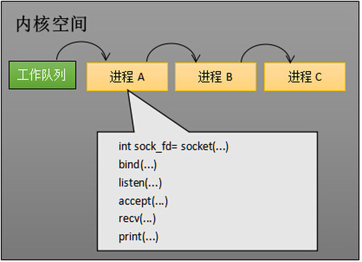

当进程 A 执行了创建 socket的语句时，操作系统会创建一个由文件管理系统管理的socket对象。这个socket对象包含了发送缓冲区、接收缓冲区、等待队列等成员。**等待队列**是一个非常特殊的结构，它**指向所有需要等待该socket事件的进程**。

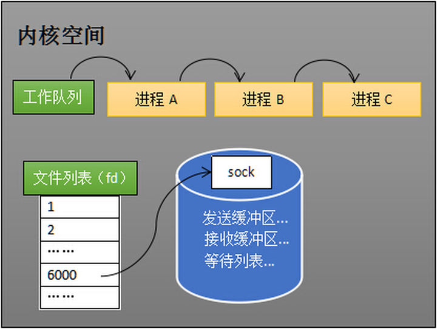

当程序执行到recv 时，操作系统会将进程 A 从工作队列移动到该socket的等待队列中。此时 CPU 不会执行到进程 A 的程序，所以进程 A 被阻塞。


当计算机收到对端传送的数据，cpu 执行中断程序，一方面将网络数据写入到socket对应的接收缓冲区里，另一方面唤醒进程 A，重新将进程 A 放入工作队列中。

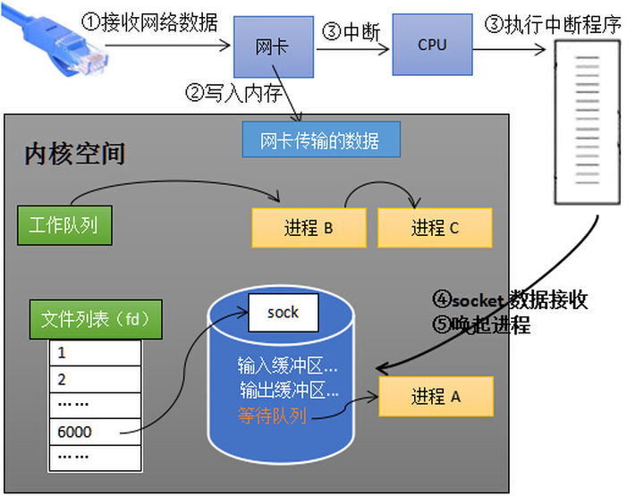

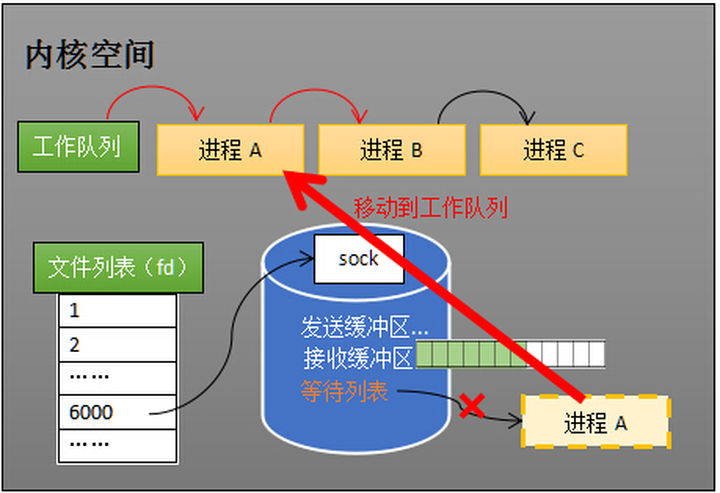

上面的过程展示了一个socket的监听结果，当涉及同时监听多个socket时，也就是 I/O 复用。

### select

预先传入一个socket列表，如果列表中的socket都没有数据，则挂起进程，直到至少有一个socket收到数据，唤醒进程。

下面时select的大致用法。

```C++
int s = socket(AF_INET, SOCK_STREAM, 0);  
bind(s, ...)
listen(s, ...)

int fds[] //存放需要监听的socket

while(1){
    int n = select(..., fds, ...)
    for(int i=0; i < fds.count; i++){
        if(FD_ISSET(fds[i], ...)){
            //fds[i]的数据处理
        }
    }
}
```

加入程序同时监视socket1、socket2 和 socket3 这三个socket，那么调用select后，操作系统把进程 A  分别加入这三个socket的等待队列中。

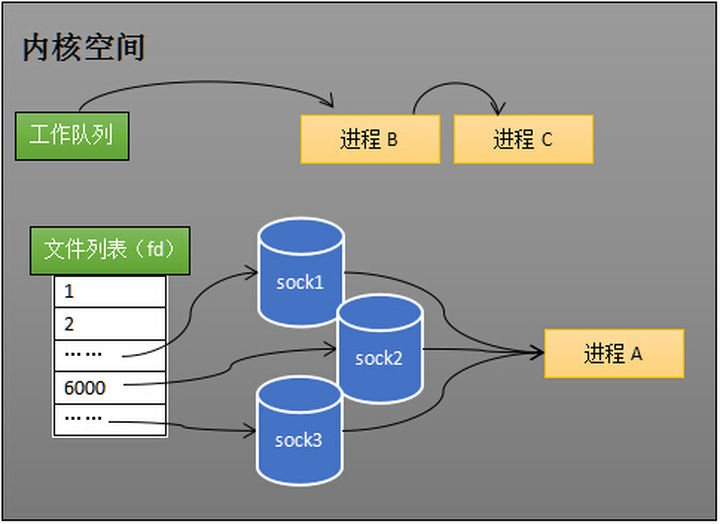

当任何一个socket收到数据后，中断程序将唤起进程。下图展示了socket接收到了数据。


进程 A 被唤起，将它从所有的等待队列中移除，加入到工作队列中。

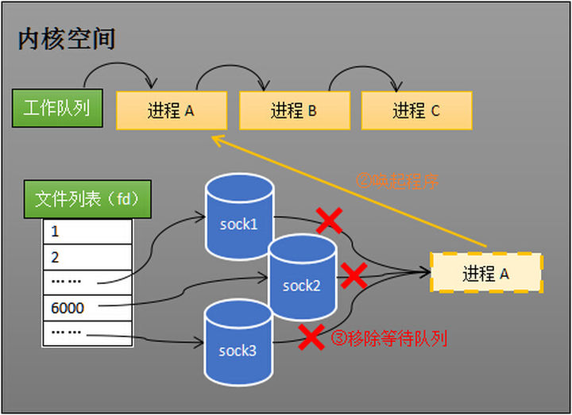

进程被唤醒之后，程序只需要遍历一遍socket列表就可以得到就绪的socket。

步骤

- 将需要监听的文件描述符放入一个集合fdset（逻辑上可看作bit vector）中，调用select时，将这个集合从用户空间拷贝到内核空间。
- 内核根据文件就绪状态修改集合的内容
- select函数返回后，需要通过遍历这个集合找到就绪的文件描述符。

缺点

- 每次调用select，都需要把fd集合拷贝到内核空间，开销大
- 因为内核会修改集合内容，所以每次都需要重置集合
- 轮询的方式效率低下，尤其是集合稀疏且有较大文件描述符的时候。
- 进程被唤醒之后，程序并不知道哪些socket收到数据，还需要遍历一次。
- 集合大小限制，32-bit：1024，64-bit：2048。

优点：

- 几乎在所有平台上都支持，良好的跨平台性。

### poll

不同于select的静态集合，poll 使用一个pollfd的指针来实现。

```c++
int poll(struct pollfd* fds, nfds_t nfds, int timeout);

struct pollfd{
    int fd; // file descriptor
    short events; //requested events to watch
    short revents; // returned events witnessed
}
```

使用时可传入一个pollfd 数组

```C++
struct pollfd fds[10];
poll(fds, 10, 1000);
```

优点：

- 集合没有最大连接数量的限制。
- 对于值很大的文件描述符，效率仍然很高
- 可以动态创建大小合适的数组
- 输入和输出分离，不需要重置数组就可以重新使用。

缺点：

- 每次调用poll仍然需要将fd数组复制到内核空间。

- 仍然需要遍历描述符集合来确定可用的描述符。

### epoll

select 和 poll每次调用都需要在内核中重新维护一个等待队列，然后阻塞。epoll将这两个操作分开。先用epoll_ctl维护等待队列，再调用epoll_wait阻塞进程。

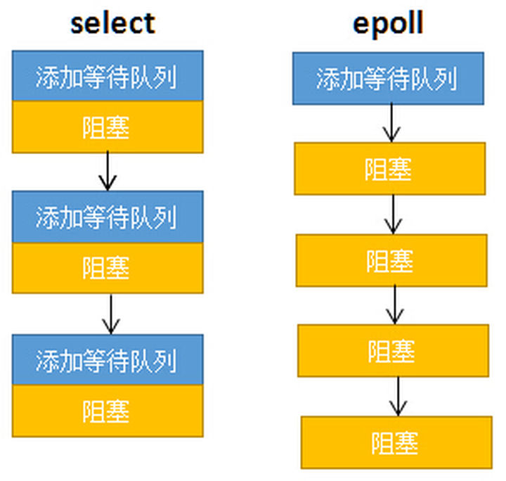

epoll用法

```C++
int s = socket(AF_INET, SOCK_STREAM, 0);   
bind(s, ...)
listen(s, ...)

int epfd = epoll_create(...);
epoll_ctl(epfd, ...); //将所有需要监听的socket添加到epfd中

while(1){
    int n = epoll_wait(...)
    for(接收到数据的socket){
        //处理
    }
}
```

三个epoll函数

```C++
int epoll_create(int size);
int epoll_ctl(int epfd, int op, int fd, struct epoll_event* event);
int epoll_wait(int epfd, struct epoll_event* events, int maxevents, int timeout);
```

#### epoll_create

内核创建一个eventpoll对象，其也是文件系统中的一员，和socket一样，也有等待队列。

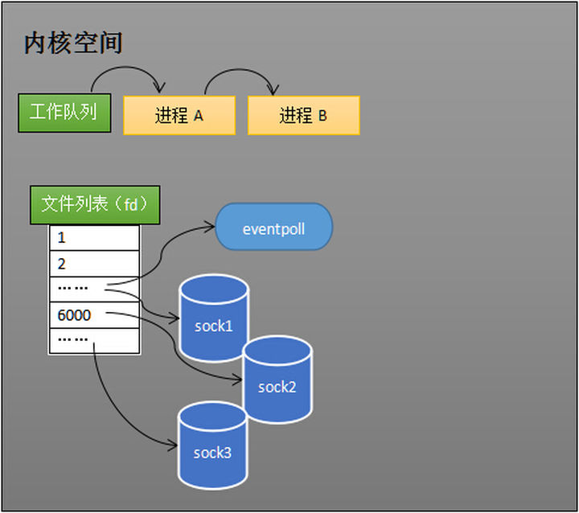

#### epoll_ctl

epoll_ctl用于添加或删除所要监听的socket。如下通过epoll_ctl添加socket1、socket2和socket3的监视，内核会将eventpoll添加到这三个socket的等待队列中。当socket收到数据后，中断程序会操作eventpoll对象，而不是直接操作进程。

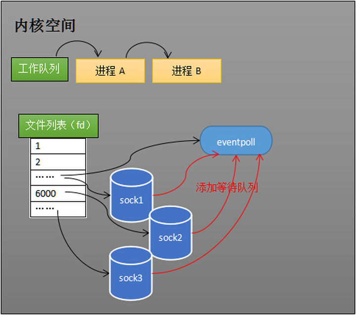


当socket收到数据后，中断程序会给eventpoll中的就绪列表添加socket引用，如下所示，socket2 和 socket3 收到数据后，中断程序让rdlist引用这两个socket。


#### epoll_wait

当程序执行到epoll_wait时，如果rdlist已经引用了socket，那么epoll_wait直接返回，如果rdlist为空，内核会将该进程放入eventpoll的等待队列中，阻塞进程。


当至少一个socket收到数据，中断程序一方面修改rdlist，另一方面唤醒eventpoll等待队列中的进程，进程A 进入工作队列。由于rdlist的存在，进程 A 在不需要遍历所有socket的前提下就可以知道哪些socket发生了变化。

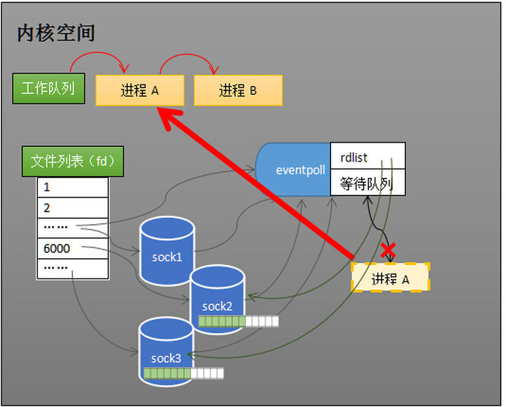