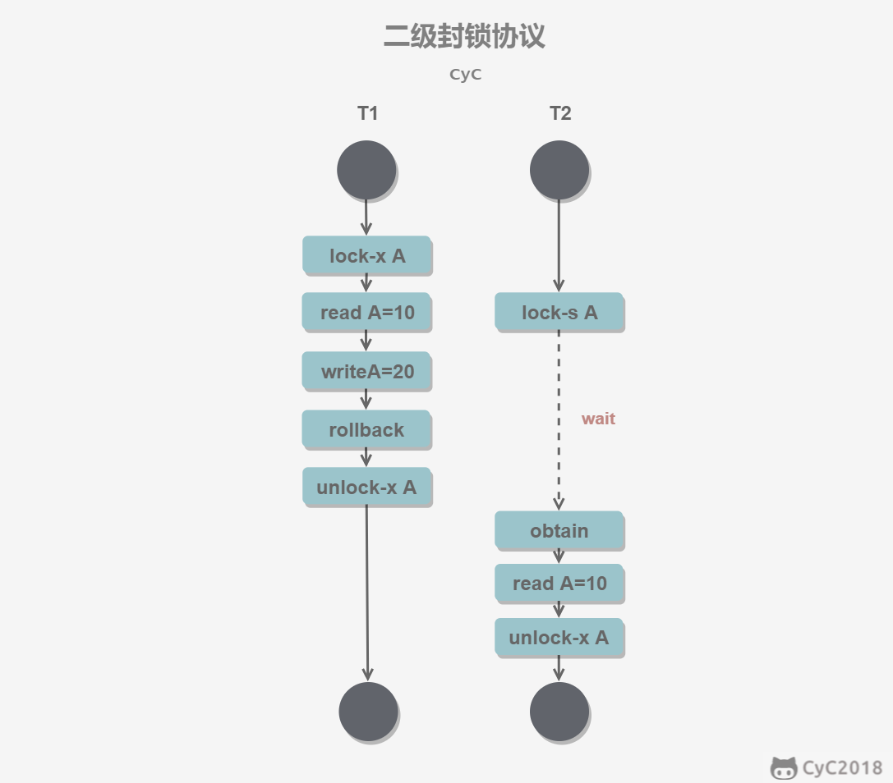

# 事务

## 1. 概念

事务指的是满足 ACID 特性的一组操作序列。

## 2. ACID

- **原子性**：事务被视为不可分割的最小单元，事务的所有操作要么全部提交成功，要么全部失败回滚。

- **一致性**：数据库在事务执行前后都保持一致性状态。

- **隔离性**：一个事务所做的修改在最终提交前，对其它事务是不可见的。

- **持久性**：一旦事务提交，则其所做的修改将会永远保存到数据库中。即使系统发生崩溃，事务执行的结果也不能丢失。

ACID 的这几个特性不是平级关系

- 只有满足一致性，事务的执行结果才是正确的
- 在无并发的情况下，事务串行执行，隔离性一定能够满足。此时只要满足原子性，就一定能满足一致性。
- 在并发的情况下，多个事务并行执行。事务不仅要满足原子性，还需要满足隔离性，才能满足一致性。

## 3. 并发一致性问题

### 3.1 丢失修改

丢失修改指一个事务的更新操作被另一个事务的更新操作替换。如下图 T1 对 A 的修改被 T2 对 A 的修改覆盖

### 3.2 读脏数据

指在不同事务下，当前事务可以读到另外事务未提交的数据。例如 T1 修改一个数据但未提交，T2 随后读取这个数据。如果 T1 撤销了这次修改，那么 T2 读取的数据就是脏数据。

### 3.3 不可重复读

不可重复读指在**一个事务**内多次读取同一数据集合。在这一事务还未结束前，另一事务也访问了该同一数据并做了修改，由于第二个事务的修改，第一个事务的两次读取的数据可能不一致。**针对update操作**。

### 3.4 幻影读

幻读本质上也属于不可重复度的情况。T1 读取某个范围的数据，T2 在这个范围内插入新的数据，T1再次读取这个范围的数据，此时读取的结果和第一次读取的结果不同。**针对insert和delete操作**。

产生并发不一致的问题的主要原因是破环了事务的隔离性，可以通过并发控制来保证隔离性。并发控制可以通过封锁来实现，但是封锁操作需要用户自己控制，相当复杂。数据库管理系统提供了事务的隔离级别，让用户以一种更轻松的方式处理并发一致性问题。

## 4. 封锁

### 4.1 封锁粒度

MySQL中提供了两种封锁粒度：**行级锁**和**表级锁**

- 应该尽量只锁定需要修改的那部分数据，而不是所有资源。锁定的数据量越少，发生锁争用的可能性就越小，系统的并发程度就越高。
- 加锁本身需要消耗资源。因此封锁粒度越小，系统开销就越大。

在选择封锁粒度时，需要在锁开销和并发程度之间做一个权衡。

### 4.2 封锁类型

- **读写锁**

  - 互斥锁（Exclusive），简写为 X 锁，又称写锁
  - 共享锁（Shared）,简写为 S 锁，有称读锁。

  有以下两个规定：

  - 一个事务对数据对象 A 加了 X 锁，就可以对 A 进行读取和更新。加锁期间其它事务不能对 A 加任何锁。
  - 一个事务对数据对象 A 加了 S 锁，可以对  A 进行读取操作，但是不能进行更新操作，加锁期间其它事务能对  A 加 S 锁，但是不能加  X 锁

- **意向锁**

  使用意向锁可以更容易的支持多粒度封锁。根据粒度的大小，可以构建出一颗树，大粒度为父节点，小粒度为子节点。**在对子节点加 S / X 锁时，要先对其所有父节点先加 IS / IX 锁**。

  在对大粒度加锁时（比如表锁），需要检测是不是已经有了更小粒度（比如某一行）的其它锁，才能判断是不是可以加锁成功。那么就需要对整棵树都进行检测，这是非常耗时的。

  另外在对小粒度加锁时，也需要检测是不是在其所在的大粒度上已经加了冲突的锁，这需要检测从根节点到该节点的路径上的所有节点。

  

  注意到**任意 IS / IX 之间都是兼容的**，因为它们只表示想要对表加锁，而不是真正的加锁。

### 4.3 乐观锁和悲观锁

#### 4.3.1 概念

乐观锁和悲观锁是两种思想，用于解决并发场景下的数据竞争问题。

- **悲观锁**：操作数据时比较悲观，认为有其它事务会同时修改数据。因此操作数据时对数据进行上锁，直到操作完成后才会释放锁，上锁期间其它事务不能修改数据。
- **乐观锁**：操作数据时比较乐观，认为不会有其它事务同时修改数据。因此操作数据时不会上锁，只是在执行更新的时候判断一下在此期间其它事务是否修改了数据。如果其它事务修改了数据则放弃操作。

乐观锁的实现方式：

- **版本号机制**：为数据加一个版本号或时间戳字段。
  - 取出记录时，获取当前version
  - 数据更新时同时更新这个字段
  - 更新的时候比较以下，只有字段没有变化时才进行更新
- **CAS算法**：记录需要读写的内存位置V，进行比较的原值 A 和 拟写入的新值 B
  - 如果内存位置 V 的值与预期原值 A 相匹配，那么执行更新，否则不执行。

#### 4.3.2 适用场景

 悲观锁适用于数据写入比较频繁的场景下，这种场景下冲突发生的概率高，使用悲观锁可以有效的避免冲突发生。

乐观锁适用于多读少些的情景，即冲突发生比较少的情景。

### 4.4 三级封锁协议

- **一级封锁协议**：事务在修改数据之前必须先对其加 X 锁，直到事务结束才释放。

  可以解决丢失修改问题，因为不能同时有两个事务对同一个数据进行加 X 锁。

  

- **二级封锁协议**：在一级的基础上，事务在读取数据之前必须先加 S 锁，读取完马上释放。

  可以解决脏读问题，因为现在规定了读数据前要加 S 锁，如果一个事务在对数据 A 进行修改，根据一级封锁协议，会加 X 锁，那么就不能再加 S 锁了，也就是不会读入数据。

  

- **三级封锁协议**：在二级的基础上，事务在读取数据前必须先加 S 锁，直到事务结束才能释放。

  可以解决不可重复读的问题。因为读  A 时，其它事务不能对 A 加 X 锁，从而避免了同一事务的两次读期间数据发生改变。

### 4.5 两段锁协议

#### 4.5.1 概念

事务必须严格分为两个阶段对数据进行加锁和解锁的操作，第一阶段加锁，第二阶段解锁。也就是说一个事务中途一旦释放了锁，就不能再申请新锁了。

**可串行化调度**：通过并发控制，使得并发执行的事务结果与某个串行执行的事务结果相同。即不会出现并发一致性问题。

**事务遵循两段锁协议是保证可串行化调度的充分条件**。

此外，两阶段锁并不保证不会发生死锁。

#### 4.5.2 扩展

**严格两阶段锁**：除了要求封锁是两阶段之外，还要求事务持有的所有排他锁必须在事务提交后才能释放。防止了级联回滚。

**强两阶段锁**：要求事务提交之前不得释放任何锁。

## 5. 隔离级别

- **未提交读**（READ UNCOMMITTED）

  事务中的修改，即使没有提交，对其它事务也是可见的。

- **提交读**（READ COMMITTED）

  一个事务只能读取已经提交的事务所做的修改。也即一个事务所做的修改在提交之前对其它事务是不可见的。

- **可重复读**（REPEATABLE READ）

  保证在同一个事务中多次读取同一数据的结果是一样的。

- **可串行化**（SERIALIZABLE）

  强制事务串行执行，这样不会出现并发一致性问题，但也丧失了并发的优势。

## 6. 多版本并发控制（MVCC）

### 6.1 概念

- 读-读：不存在任何问题，不需要并发控制。
- 读-写：有线程安全问题，可能会导致事务隔离性问题。
- 写-写：有线程安全问题，可能会存在更新丢失问题。

多版本并发控制是一种用来解决**读-写**冲突的无锁并发控制。实现了**非阻塞的读**操作。其中多版本指的是**维持一个数据的多个版本**，将每一项数据的旧值拷贝保存在系统中。

不同存储引擎的 MVCC 实现方式不同。InnoDB 通过在每行记录后面保存**两个隐藏的列**来实现。一个保存行的创建时间，另一个保存行的过期时间（也即被删除的时间）。

存储的不是实际的时间值，而是**系统版本号**。每开始一个新事务，系统版本号都会自动递增。

- **SELECT**

  - 只查找版本号小于等于当前事务版本号的数据行。可以确保事务读取的行，要么在事务开始前已经存在，要么是事务自身插入或者修改过的。
  - 行的删除版本号要么未定义，要么大于当前事务版本号。可以确保事务读取到的行在事务开始前未被删除。

- **INSERT**

  为新插入的每一行保存当前系统版本号作为行版本号。

- **DELETE**

  为删除的每一行保存当前系统版本号作为行删除的标识。

- **UPDATE**

  为插入的每一行新记录，保存当前系统版本号作为行版本号，同时保存当前系统版本号到原来的行作为行删除标识。

### 6.2 当前读和快照读

- 读取的是记录的最新版本，读取时还要保证其它并发事务不能修改当前记录，会对读取的记录进行加锁。
- MVCC 的读取是快照读。指的是从数据快照中（之前的版本中）选择合适的版本读取，无需加锁。

## 7. Next-Key Locks

Next-Key Locks 是 MySQL 的 InnoDB 存储引擎的一种锁实现，来解决幻读问题。

MVCC 不能解决幻读问题，在可重复读隔离级别下，使用 MVCC  + Next-Key Locks可以解决幻读问题。

**Record Locks**：锁定一行记录

**Gap Locks**：锁定记录之间的间隙，但是不包括记录本身。

**Next-Key Locks**：Record Locks 和 Gap Locks 的结合，不仅锁定记录，而且锁定记录之间的间隙，即它锁定一个区间。

## 8. 日志

