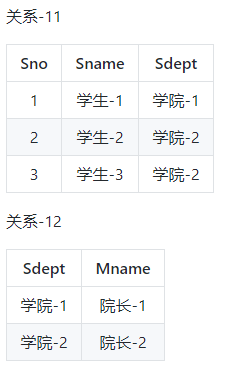

## 关系数据库设计理论

### 函数依赖

记 R 为关系 $r$ 的属性集合，$\alpha$ 和 $\beta$ 分别是 R 的子集，则 函数依赖 $\alpha -> \beta$ 的条件是，对于关系实例中的所有元组对 $t_1$ 和 $t_2$，若 $t_1[\alpha] = t_2[\alpha]$ 则 $t_1[\beta] = t_2[\beta]$。也即是说属性子集 $\alpha$ 可以代表属性子集 $\beta$。

对于$\alpha -> \beta$，如果存在一个 $\alpha$  的真子集 $\alpha_1$ 使得 $\alpha_1 -> \beta$，那么 $\alpha -> \beta$ 就是部分函数依赖，否则就是完全函数依赖。

如果 $S -> R$，则称 $S$ 是关系 $r$ 的一个**超码**。

最小的超码，即它的任意真子集都不能成为超码，这样的最小超码成为**候选码**。

### 异常

以下一个学生课程关系的函数依赖为 {Sno, Cname} -> {Sname, Sdept, Mnama, Grade}。也就是说，确定学生和课程之后，就能确定其它信息。

不符合范式的关系，会产生很多异常。

- 冗余数据：例如``学院-2``和``院长-2``出现了三次
- 修改异常：修改了一个记录中的信息，但是另一个记录中相同的信息缺没有被修改。
- 删除异常：删除一个信息，其它信息也丢失了。例如删除了``课程-1``，需要同时删除第一行和第三行，那么``学生-1`` 的信息就丢失了
- 插入异常：例如想要插入一个学生的信息，但是这个学生还没有选课，那么就会导致插入异常。

### 范式

范式理论是为了解决以上提到的四种异常。

高级别的范式依赖于低级别的范式。

#### 1. 第一范式

要求属性具有**原子性**，不可再分解。

例如表示学生的一组属性，（学号，姓名，出生年月日），如果认为最后一列还可以再分解成（出生年，出生月，出生日），它就不是第一范式，否则就是。

#### 2. 第二范式

要求记录的**唯一性**，每个非主属性完全依赖于键码，不存在部分依赖。

以上关系中，键码为 {Sno, Cname}，有如下函数依赖

- Sno -> Sname, Sdept
- Sdept -> Mname
- Sno, Cname -> Grade

可以看到，Grade 完全依赖于键码，但是 Sname, Sdept 和 Mname 都部分依赖于键码。

这种情况需要对关系进行分解。

有以下函数依赖：

- Sno -> Sname, Sdept
- Sdept -> Mname

有以下函数依赖：

- Sno, Cname -> Grade

#### 3. 第三范式

要求不存在传递依赖。

上面的关系1中存在以下传递依赖：

- Sno -> Sdept -> Mname

可以继续进行分解

### ER 图

Entiry-Relationship 图，即实体-联系图，有三个组成部分：实体、属性、联系。

上图指出了教师和系之间的member联系。