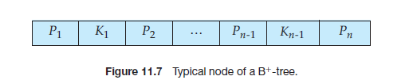
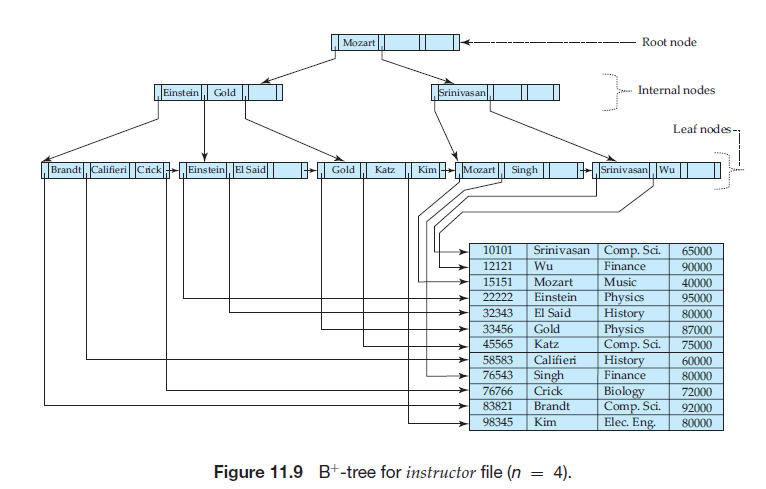
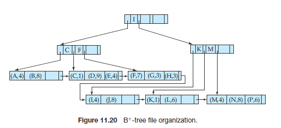
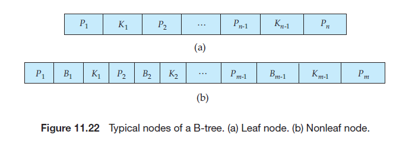

## 索引类型

### 1. B+ Tree 索引

#### 概念

B+ Tree 结点，最多包含 n - 1 个搜索码值 $K_1,K_2,...,K_{n-1}$，以及 n 个指针，$P_1,P_2,...,P_{n}$。每个结点中的搜索码值排序存放，如果 $i < j$，那么 $K_i < K_j$。

- 叶子结点：对 $i = 1, 2, ..., n - 1$，$P_i$ 指向具有搜索码值 $K_i$ 的一条文件记录。$P_n$ 则负责将叶结点之间连在一起。允许包含的值的个数最少为 (n - 1) / 2 个。
- 非叶结点：非叶结点的结构和叶结点的相同，只不过非叶结点中所有的指针都是指向树中结点的指针。最多容纳 n 个指针，最少容纳 n / 2 个 指针。
- 根结点与其他非叶结点不同，包含的指针数可以小于 n / 2；但是除非整棵树只有一个结点，否则根结点必须至少包含两个指针。

B+ Tree的一个扩展是，不仅把 B+ Tree结构作为索引使用，而且把它作为一个文件中的记录的组织者。此时，**树的叶结点存储的是记录而不是指向记录的指针**。

#### 和 B-Tree的不同

- 在B+树中给，搜索码值可能同时出现在非叶节点和叶结点中，但是B树只允许搜索码值出现一次。也是由于这个原因，B 树的非叶结点还需要为每一个搜索码增加一个指针域，指向文件记录。
- B 树有时不需要到达叶结点就能找到想要的值，因为非叶结点中也存有记录。
- 由于非叶结点中的额外的指针域，导致 B 树的非叶结点中存储的搜索码较少，因而比相应的 B+ 树的深度大。

#### B+ 树相对于 B 树的优点

- I/O 次数少：B+ 树的非叶结点中可以存储更多的索引值（搜索码），因此树的高度相对较低。
- 范围查询效率更高：由于B+树中的叶子结点串联在一起，所以可以方便的实现范围查询。

#### 聚集索引和非聚集索引

一个文件可以有多个索引，分别基于不同的搜索码。

- 如果包含记录的文件按照某个搜索码指定的顺序排序，那么该搜索码对应的索引成为**聚集索引**或**主索引**。每张表只能有一个聚集索引。
- 搜索码指定的顺序与文件中记录的物理顺序不同的索引称为**非聚集索引**或**辅助索引**。

主索引这个术语看起来是表示建立在主码上的索引，但实际上它可以建立在任何搜索码上。

在辅助索引中，一般不存储直接指向被索引的记录的指针，而是存储主索引搜索码属性的值。

聚集索引的优势：

- **可以把相关数据保存在一起**。例如实现电子邮箱时，可以根据用户 ID 来聚集数据，这样只需要从磁盘读取少量的数据页就能获取某个用户的全部邮件。
- **数据访问更快**。InnoDB 聚集索引将索引和数据保存在同一个B-Tree中，因此从聚集索引中获取数据通常要比在非聚集索引中查找要快。

### 2. 哈希索引

哈希索引能以O(1)时间进行查找，但是失去了有序性

- 无法用于排序和分组
- 只支持精确查找，无法用于部分和范围查找

InnoDB 存储引擎有一个特殊的功能叫做**自适应哈希索引**，当某个索引值被使用的非常频繁的时候，会在 B+Tree 索引之上再创建一个哈希索引，这样就让 B+ Tree 索引具有哈希索引的一些优点，比如快速的哈希查找。

### 3. 全文索引

MyISAM 存储支持全文索引，用于查找文本中的关键词，而不是直接比较是否相等。

### 4. 空间数据索引

MyISAM 存储引擎支持空间数据索引（R-Tree），可以用于存储地理数据。空间数据索引会从所有维度来索引数据，可以有效地使用任意维度来进行组合查询。

## 索引优化

### 1. 独立的列

在进行查询的时候，索引列不能是表达式的一部分，也不能是函数的参数，否则无法使用索引。

### 2. 多列索引

在需要使用多个列作为条件进行查询的时候，使用多列索引比使用多个单列索引性能更好。

### 3. 索引列的顺序

让选择性最强的索引列放在前面。

索引的选择性是指：不重复的索引值和记录总数的比值。最大值为 1，此时每个记录都有一个唯一的索引与其对应。选择性越高，每个记录的区分度越高，查询效率也越高。

### 4. 前缀索引

### 5. 覆盖索引

指一个查询语句的执行只用从索引中就能够取得，不必从数据表中读取。

具有以下优点：

- 索引通常远小于数据行的大小，只读取索引能大大减少数据访问量
- 一些存储引擎（例如 MyISAM）在内存中只缓存索引，从而数据依赖于操作系统来缓存。因此，只访问索引可以不使用系统调用（通常比较费时）。

## 索引的优点

- 大大减少了服务器需要扫描的数据行数。
- 帮助服务器避免进行排序和分组（B+Tree 索引是有序的），以及避免创建临时表（临时表主要是在排序和分组过程中创建，不需要排序和分组也就不需要创建临时表）。
- 将随机 I/O 变为顺序 I/O（B+Tree 索引是有序的，会将相邻的数据都存储在一起）

