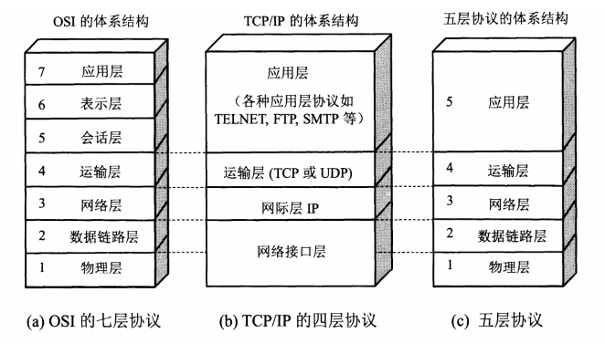
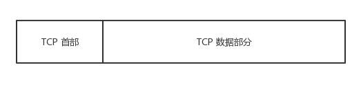
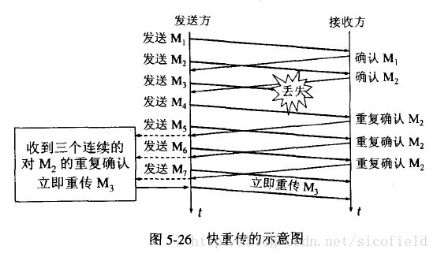

### 计算机网络体系结构

------



- **应用层**：为*特定应用* 程序提供数据传输服务。协议有HTTP, FTP, DNS 等。

- **传输层**：为*进程* 提供通用的数据传输服务。协议有TCP, UDP 等。

- **网络层**：为*主机* 提供数据传输服务。协议有IP, ARP, OSPF等。（路由器）

- **数据链路层**：将网络层的包封装成帧。（交换机）

- **物理层**：考虑的是怎样在传输媒体上传输数据比特流。

  

### 从输入 URL 到展现页面的全过程

------

1. **DNS解析**：用户输入的URL一般是域名，需要从DNS服务器中获取对应的ip地址

2. **TCP连接**：获取服务器的ip地址后，发起TCP连接请求，三次握手建立连接后就可以将HTTP请求发送给服务器

3. **发送HTTP请求**：按照HTTP协议标准发送请求数据

4. **服务器处理请求并返回**：服务器接收到请求后，将数据或错误信息返回给客户端

5. **浏览器渲染**：浏览器根据返回的数据渲染网页

6. **断开连接**：客户端和服务器经过4次挥手终止TCP连接

   

### TCP

------

#### TCP报文结构



#### TCP首部


- **序列号**：用于对自己一方的字节流进行编号，例如序号为 301，表示第一个字节的编号为 301，如果携带的数据长度为 100 字节，那么下一个报文段的序号应为 401
- **确认号**：期望收到的对方的下一个报文段的序号。例如 B 收到 A 发送来的一个报文段，序号为 501，携带的数据长度为 200 字节，那么B期望下一个报文段的序号为 701，B发送给A的确认报文段中确认好就为 701
- **数据偏移**：指的是数据部分距离报文段起始处的偏移量，实际上指的是 TCP 首部的长度
- **确认 ACK**：当 ACK=1 时确认号字段有效，否则无效。TCP 规定，在连接建立后所有传送的报文段都必须把 ACK 置 1。
- **同步 SYN**：在连接建立时用来同步序号。当 SYN=1, ACK=0 时表示这是一个连接请求报文段。若对方同意建立连接，则相应报文中 SYN=1, ACK =1。
- **终止 FIN**：用来释放一个连接，当 FIN=1 时，表示此报文段的发送方的数据已发送完毕，并要求释放连接。
- **窗口**：窗口值作为接收方让发送方设置其发送窗口大小的依据。之所以要有这个限制，是因为接收方的数据缓存空间是有限的。

#### TCP的三次握手


##### 连接过程

假设 A 为客户端，B 为服务端

1. A 向 B 发送连接请求报文，SYN=1, ACK=0，以及一个初始的序列号 x
2. B 收到请求连接的报文，如果同意建立连接，则向 A 发送连接确认报文，SYN=1, ACK=1, 确认号为 x+1，同时也包含自己的初始序列号 y
3. A 收到 B 的确认连接的报文后，还要向 B 发出确认，确认号为 y+1，序列号为 x+1。B 收到 A 的确认后，连接建立

##### 为什么需要三次握手

- 防止失效的连接请求到达服务器，让服务器错误打开连接

  ```
  假设 Client 发出的第一个连接请求报文在某个网络结点滞留了，Client在超时后（指没有收到ACK确定）进行重传，这样网络中就有了两个连接请求，最终服务端会收到这两个请求，如果不采用三次握手，那么只要 Server发出确认，新的连接就建立了，这样就会针对同一个Client的请求建立起两个重复的连接。
  采用三次握手的方法可以防止上述现象发生，Client不会向Server发出的重复确认进行确认回复，Server收不到确认就会关闭连接（准确来说收不到确认会默认超时重发五次，之后自动关闭连接进入CLOSED状态）。
  ```

- 双方需要就初始序列号达成一致，三次握手可以保证 Client 和 Server之间成功互换初始序列号

##### 第三次握手中，如果客户端的 ACK 未送达服务器，会怎样

- Server 端：由于 Server 没有收到 ACK 确认，因此会超时重发之前的 SYN+ACK（默认重发五次，之后自动关闭连接进入 CLOSED 状态）
- Client 端：在 Server 进行超时重发的过程中，如果 Client 向服务端发送数据，因为数据头部的 ACK 是 1，所以服务端收到数据后会读取确认号 (Ack number)，进入 Establish 状态；在Server进入CLOSED状态后，如果 Client 向服务器发送数据，服务器会以 RST 包应答。

*Client不会超时重传这个 ACK,因为TCP不会为没有数据的ACK超时重传，但是由于TCP的设计者将SYN这个同步标志位设计成占用一个字节的标号（FIN标志位也是），既然是一个字节的数据，所以在Server没有收到ACK应答的时候会进行超时重传。*

##### 如果已经建立了连接，但是客户端出现了故障

服务器每收到一次客户端的请求后都会重新复位一个计时器，时间通常是设置为2小时，若2小时还没有收到客户端的任何数据，服务器就会发送一个探测报文，以后每隔75秒发送一次。如果连续发送10个探测报文任然没有反应，服务器就会关闭连接。


#### TCP的四次挥手


##### 断开过程

1. A 发送断开连接报文，FIN=1
2. B 收到之后发出 ACK 确认，进入CLOSE_WAIT状态。此时 TCP 处于半关闭状态，A 已经没有要发送给 B 的数据了，但是仍然可以接受来自 B 的数据。
3. 当 B 不再需要连接时，发送断开连接报文，FIN=1
4. A 收到后发出 ACK 确认，进入 TIME-WAIT 状态，等待 2 MSL（最大报文存活时间）后关闭连接。B 收到 A 的确认后关闭连接。

##### 为什么需要四次挥手

即可不可以把 B 发送的 ACK 和 FIN 合并起来，变成三次挥手？不能，因为 Server 收到 Client  的断开连接的请求时，可能还有一些数据没有发完，这时先回复 ACK ，表示收到了断开连接的请求，等到数据发完之后再发 FIN。

##### 客户端 TIME_WAIT 的意义是什么

第四次挥手的时候，Client 发送给 Server 的 ACK 可能丢失。如果 Server 没有收到 ACK 就会重发 FIN，如果此时 Client 已经关闭连接了，那么 Server 也就不可能收到 ACK 了，会不断进行重发，直到达到重发次数的上限，TIME_WAIT 的意义就是为了避免这种情况发生。

一个 MSL 指一个片段再网络中最大的存活时间，2MSL就是一个发送和一个回复所需的最大时间。如果直到 2MSL，Client 都没有再次收到 FIN，那么 Client 推断 ACK 已经被成功接收，则结束 TCP 连接。

#### TCP如何保证传输的可靠性

- 数据包校验
- 对失序的数据包重新排序
- 丢弃重复的数据
- 应答机制：接收方收到数据后，会发送ACK确认
- 超时重传：发送方发出数据后，启动一个定时器，超时未收到接收方的确认，则重新发送这个数据
- 流量控制：确保接收方能够接收发送方的数据而不会缓冲区溢出

#### TCP 滑动窗口（流量控制）

每发送一个包就等待一个 ACK 号的方式，会造成时间的浪费。滑动窗口就是在发送一个包后，不等待 ACK 号返回就直接发送后续的一系列包。这样一来，等待 ACK 号的这段时间就被有效利用起来了


要考虑发送包的频率超过接收方处理的能力，防止溢出。接收方需要告诉发送方自己最多能接收多少数据，然后发送方根据这个值对数据发送操作进行控制。


#### TCP 拥塞控制

拥塞控制和流量控制都是为了控制发送方的速率，但是出发点不同。流量控制是为了让接收方能来得及接收，而拥塞控制是为了降低整个网络的拥塞程度。

##### 方法

- 慢启动
- 拥塞避免
- 快重传
- 快恢复


##### 慢启动

刚开始发送数据时，先把拥塞窗口（cwnd）设置为一个最大报文段 MSS 的数值，每收到一个新的确认报文之后，就把拥塞窗口加 1 个 MSS。这样每经过一个传输轮次，cwnd就会翻倍。


##### 拥塞控制

cwnd 增长速度非常快，从而使得发送方发送的速度增长过快。设置一个慢启动门限 ssthresh，当 cwnd >= ssthresh 时，进入拥塞避免，每个轮次只能增加 1 MSS。

如果出现了超时，则令 ssthresh = cwnd / 2，然后重新从慢启动开始, cwnd = 1。

##### 快重传

快重传要求接收方在收到一个失序的报文段后就立即发出**重复确认**。例如已经收到 M1 和 M2，此时收到 M4 ，应当发送对 M2 的确认。

发送方只要一连收到三个重复确认就应当立即重传丢失的报文。例如收到三个 M2，则 M3 丢失，立即重传 M3。



##### 快恢复

在上一阶段只是丢失了个别报文，而不是网络拥塞，因此执行快恢复，令 ssthresh = cwnd / 2，cwnd = ssthresh，注意此时会直接进入拥塞避免。

*慢启动和快恢复的快慢指的是 cwnd的设定值，而不是 cwnd的增长速率。慢启动 cwnd=1，而快恢复 cwnd=ssthresh。*


### UDP

------

#### UDP 首部


#### TCP 和 UDP 的区别

- TCP 是面向连接的；UDP 是无连接的，发送前不需要建立连接

- TCP 是可靠的；UDP 是不可靠的，接收方收到报文后，不需要给出任何确认。

- TCP 只支持点到点通信；UDP 支持一对一、一对多、多对以、多对多。

- TCP 是面向字节流的；UDP 是面向报文的。

  ```
  面向字节流是指发送数据时以字节为单位，一个数据包可以拆分成若干组进行发送，而 UDP一个报文只能一次发完。
  ```

- TCP 有拥塞控制；UDP 没有

  ```
  网络出现的拥塞不会使源主机的发送速率降低，这对某些实时应用是很重要的，比如媒体通信和游戏。
  ```

- TCP 首部开销20字节；UDP 首部开销只有8字节。


### HTTP

------

#### HTTP 与 HTTPS的区别

- HTTP明文传输，数据都是未加密的，安全性较差，HTTPS（HTTP + SSL）数据传输过程是加密的，安全性较好
- 使用HTTPS协议需要到CA（Certificate Authority，数字证书认证机构）申请证书。
- HTTP 和 HTTPS 使用的端口不同，前者是80，后者是443
- HTTP页面相应的速度比HTTPS快，因为HTTPS在使用TCP三次握手建立连接之后还需要再进行SSL协商加密。

#### HTTP 1. 0/1.1/2.0 的区别

